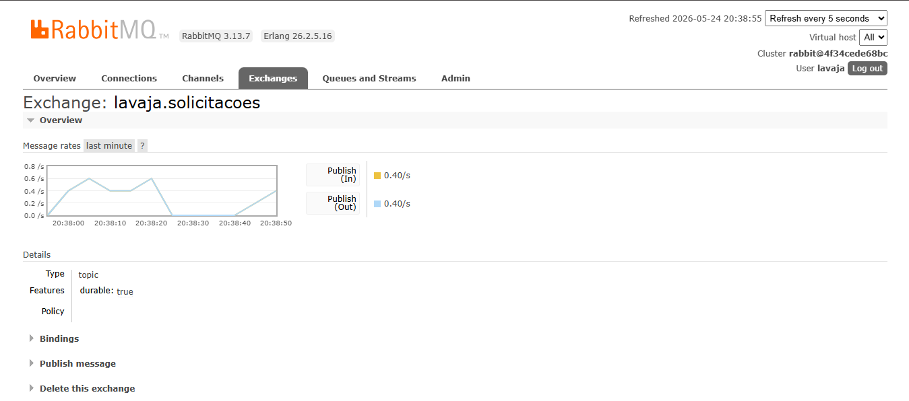
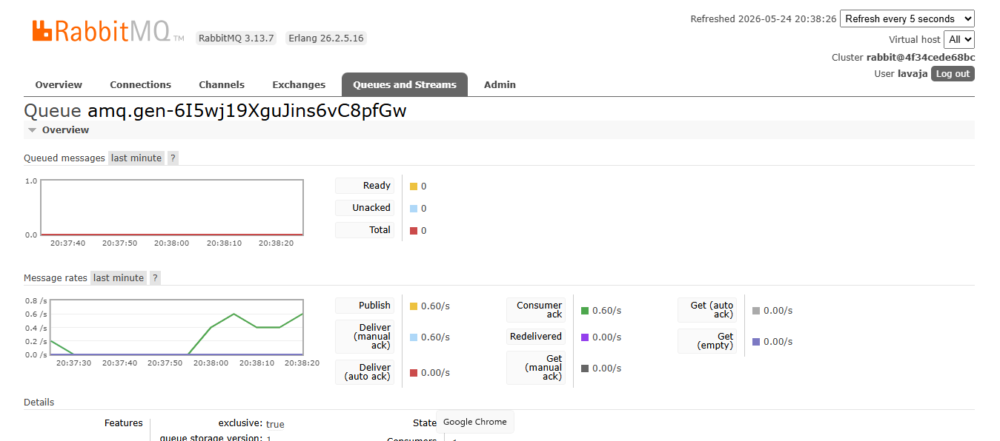

# Documentação de Integração com MOM — LavaJÁ

---

## 1. Visão Geral

O sistema **LavaJÁ** utiliza **RabbitMQ** como middleware orientado a mensagens (MOM). Toda comunicação assíncrona entre os módulos do backend é realizada via exchange RabbitMQ, sem chamadas REST diretas entre produtor e consumidor. O producer publica eventos nos momentos-chave do fluxo de negócio (criação de solicitação e atualização de status) e o consumer (`websocket.js`) processa cada mensagem de forma independente, operando como gateway integrado ao servidor HTTP — consumindo do RabbitMQ e repassando em tempo real aos apps Flutter via WebSocket.

---

## 2. Tecnologia Utilizada

| Item | Valor |
|---|---|
| MOM escolhido | RabbitMQ 3.13 |
| Biblioteca cliente | `amqplib 0.10.3` |
| Protocolo | AMQP 0-9-1 |
| Serialização | JSON (UTF-8) |
| Padrão de mensageria | Publish/Subscribe com exchange do tipo `topic` |
| Exchange | `lavaja.solicitacoes` (durable: true) |
| Durabilidade das mensagens | Sim — `persistent: true` na publicação |
| Confirmação de entrega | `channel.ack(msg)` após processamento pelo consumer |
| Infraestrutura | Docker (imagem `rabbitmq:3.13-management`) |
| Management UI | `http://localhost:15672` (user: `lavaja` / pass: `lavaja123`) |

---

## 3. Arquitetura de Comunicação Assíncrona

```
[solicitacaoService.js]
        │
        │  publish(routingKey, payload)       src/config/rabbitmq.js
        ▼
┌─────────────────────────────┐
│         RabbitMQ            │
│  exchange: lavaja.solicitacoes (topic)      │
│                             │
│  solicitacao.criada ────────┤
│  solicitacao.aceita ────────┤
│  solicitacao.recusada ──────┤──────────────────────────────────┐
│  solicitacao.em_execucao ───┤                                  │
│  solicitacao.concluida ─────┤                                  │
│  solicitacao.cancelada ─────┤                                  │
└─────────────────────────────┘                                  │
                                                                 ▼
                                                    [websocket.js — consumer]
                                                                 │
                                              solicitacao.criada → todos os lavadores
                                              demais eventos → cliente e/ou lavador
                                              específicos via usuario_id
                                                                 │
                                              ┌──────────────────┴──────────────────┐
                                              ▼                                     ▼
                                       App Cliente (Flutter)              App Lavador (Flutter)
                                       conexão WebSocket                  conexão WebSocket
```

Não há nenhuma chamada REST entre o módulo produtor (`solicitacaoService.js`) e o consumidor (`websocket.js`) — a única comunicação entre eles é via RabbitMQ.

---

## 4. Exchange e Routing Keys Configuradas

O consumer (`websocket.js`) assina **todos os eventos** do exchange com binding `#` (wildcard topic):

```
Exchange: lavaja.solicitacoes (topic, durable)
    └── Binding: #  →  fila exclusiva temporária (por processo)
```

Routing keys publicadas:

| Routing Key | Momento |
|---|---|
| `solicitacao.criada` | Nova solicitação criada pelo cliente |
| `solicitacao.aceita` | Lavador aceita a solicitação |
| `solicitacao.recusada` | Lavador recusa a solicitação |
| `solicitacao.em_execucao` | Lavador inicia a lavagem |
| `solicitacao.concluida` | Lavador conclui a lavagem |
| `solicitacao.cancelada` | Cliente cancela a solicitação |

---

## 5. Tabela de Eventos

### 5.1 `solicitacao.criada`

| Campo | Detalhe |
|---|---|
| **Routing Key** | `solicitacao.criada` |
| **Produtor** | `solicitacaoService.js` → `criar()` — disparado após persistir a solicitação no banco |
| **Consumidor** | `websocket.js` → broadcast para todos os lavadores conectados |
| **Momento** | Imediatamente após criação bem-sucedida de nova solicitação |

**Payload JSON publicado:**
```json
{
  "id": "f453970e-1f05-4031-9995-281988ad5dcc",
  "cliente_id": "bd60bd08-ae0b-4fe2-af4c-5179334d452e",
  "cliente_nome": "Ana Cliente",
  "veiculo": {
    "placa": "ABC1D23",
    "modelo": "Honda Civic"
  },
  "endereco": "Av. Afonso Pena, 1500 - BH",
  "tipo_servico": "completa",
  "status": "pendente",
  "timestamp": "2026-05-22T01:15:43.000Z"
}
```

---

### 5.2 `solicitacao.aceita`

| Campo | Detalhe |
|---|---|
| **Routing Key** | `solicitacao.aceita` |
| **Produtor** | `solicitacaoService.js` → `atualizarStatus()` |
| **Consumidor** | `websocket.js` → notifica o cliente dono da solicitação |
| **Momento** | Lavador faz PATCH `/status` com `{ "status": "aceita" }` |

**Payload JSON publicado:**
```json
{
  "id": "f453970e-1f05-4031-9995-281988ad5dcc",
  "cliente_id": "bd60bd08-ae0b-4fe2-af4c-5179334d452e",
  "lavador_id": "555b7541-f9ee-47b4-a73a-430a0b605049",
  "status_anterior": "pendente",
  "status_novo": "aceita",
  "timestamp": "2026-05-22T01:16:05.000Z"
}
```

---

### 5.3 `solicitacao.recusada`

| Campo | Detalhe |
|---|---|
| **Routing Key** | `solicitacao.recusada` |
| **Produtor** | `solicitacaoService.js` → `atualizarStatus()` |
| **Consumidor** | `websocket.js` → notifica o cliente |
| **Momento** | Lavador faz PATCH `/status` com `{ "status": "recusada" }` |

**Payload JSON publicado:**
```json
{
  "id": "a8bb598e-f9aa-47f5-8471-c4f148857a71",
  "cliente_id": "bd60bd08-ae0b-4fe2-af4c-5179334d452e",
  "lavador_id": null,
  "status_anterior": "pendente",
  "status_novo": "recusada",
  "timestamp": "2026-05-22T01:16:30.000Z"
}
```

---

### 5.4 `solicitacao.em_execucao`

| Campo | Detalhe |
|---|---|
| **Routing Key** | `solicitacao.em_execucao` |
| **Produtor** | `solicitacaoService.js` → `atualizarStatus()` |
| **Consumidor** | `websocket.js` → notifica cliente e lavador |
| **Momento** | Lavador faz PATCH `/status` com `{ "status": "em_execucao" }` |

**Payload JSON publicado:**
```json
{
  "id": "f453970e-1f05-4031-9995-281988ad5dcc",
  "cliente_id": "bd60bd08-ae0b-4fe2-af4c-5179334d452e",
  "lavador_id": "555b7541-f9ee-47b4-a73a-430a0b605049",
  "status_anterior": "aceita",
  "status_novo": "em_execucao",
  "timestamp": "2026-05-22T01:16:20.000Z"
}
```

---

### 5.5 `solicitacao.concluida`

| Campo | Detalhe |
|---|---|
| **Routing Key** | `solicitacao.concluida` |
| **Produtor** | `solicitacaoService.js` → `atualizarStatus()` |
| **Consumidor** | `websocket.js` → notifica cliente e lavador |
| **Momento** | Lavador faz PATCH `/status` com `{ "status": "concluida" }` |

**Payload JSON publicado:**
```json
{
  "id": "f453970e-1f05-4031-9995-281988ad5dcc",
  "cliente_id": "bd60bd08-ae0b-4fe2-af4c-5179334d452e",
  "lavador_id": "555b7541-f9ee-47b4-a73a-430a0b605049",
  "status_anterior": "em_execucao",
  "status_novo": "concluida",
  "timestamp": "2026-05-22T01:16:45.000Z"
}
```

---

### 5.6 `solicitacao.cancelada`

| Campo | Detalhe |
|---|---|
| **Routing Key** | `solicitacao.cancelada` |
| **Produtor** | `solicitacaoService.js` → `atualizarStatus()` |
| **Consumidor** | `websocket.js` → notifica o lavador vinculado |
| **Momento** | Cliente faz PATCH `/status` com `{ "status": "cancelada" }` (só em pendente ou aceita) |

**Payload JSON publicado:**
```json
{
  "id": "2bc33e45-79bb-4056-933a-52deda06714b",
  "cliente_id": "bd60bd08-ae0b-4fe2-af4c-5179334d452e",
  "lavador_id": null,
  "status_anterior": "pendente",
  "status_novo": "cancelada",
  "timestamp": "2026-05-22T01:16:58.000Z"
}
```

---

## 6. Evidência de Funcionamento

### 6.1 Logs de Console (Fluxo Completo — 22/05/2026)

O trecho abaixo demonstra o ciclo completo de uma solicitação, desde a criação até a conclusão, com producer e consumer operando de forma assíncrona no mesmo processo do servidor Node.js:

**Terminal — Servidor Node.js (producer + consumer no mesmo processo):**
```
✅ Migrations executadas com sucesso!
✅ RabbitMQ conectado
✅ WebSocket Gateway iniciado
✅ Consumer RabbitMQ → WebSocket Gateway ativo
🚗💦 LavaJÁ Backend rodando em http://localhost:3000
🔌 WebSocket disponível em  ws://localhost:3000
📋 Endpoints REST em        http://localhost:3000/api

📤 Evento publicado: [solicitacao.criada] f453970e-1f05-4031-9995-281988ad5dcc
📥 Evento recebido do RabbitMQ: [solicitacao.criada] f453970e-1f05-4031-9995-281988ad5dcc
📤 WebSocket broadcast → 0 lavador(s) conectado(s)

📤 Evento publicado: [solicitacao.aceita] f453970e-1f05-4031-9995-281988ad5dcc
📥 Evento recebido do RabbitMQ: [solicitacao.aceita] f453970e-1f05-4031-9995-281988ad5dcc

📤 Evento publicado: [solicitacao.em_execucao] f453970e-1f05-4031-9995-281988ad5dcc
📥 Evento recebido do RabbitMQ: [solicitacao.em_execucao] f453970e-1f05-4031-9995-281988ad5dcc

📤 Evento publicado: [solicitacao.concluida] f453970e-1f05-4031-9995-281988ad5dcc
📥 Evento recebido do RabbitMQ: [solicitacao.concluida] f453970e-1f05-4031-9995-281988ad5dcc

📤 Evento publicado: [solicitacao.criada] a8bb598e-f9aa-47f5-8471-c4f148857a71
📥 Evento recebido do RabbitMQ: [solicitacao.criada] a8bb598e-f9aa-47f5-8471-c4f148857a71
📤 WebSocket broadcast → 0 lavador(s) conectado(s)

📤 Evento publicado: [solicitacao.recusada] a8bb598e-f9aa-47f5-8471-c4f148857a71
📥 Evento recebido do RabbitMQ: [solicitacao.recusada] a8bb598e-f9aa-47f5-8471-c4f148857a71

📤 Evento publicado: [solicitacao.criada] 2bc33e45-79bb-4056-933a-52deda06714b
📥 Evento recebido do RabbitMQ: [solicitacao.criada] 2bc33e45-79bb-4056-933a-52deda06714b
📤 WebSocket broadcast → 0 lavador(s) conectado(s)

📤 Evento publicado: [solicitacao.cancelada] 2bc33e45-79bb-4056-933a-52deda06714b
📥 Evento recebido do RabbitMQ: [solicitacao.cancelada] 2bc33e45-79bb-4056-933a-52deda06714b
```

Os logs `📤 Evento publicado` são gerados por `rabbitmq.js` (producer) e os `📥 Evento recebido do RabbitMQ` por `websocket.js` (consumer) — módulos completamente independentes que se comunicam exclusivamente pelo broker.

---

### 6.2 RabbitMQ Management UI — Exchange `lavaja.solicitacoes`

Captura do painel em `http://localhost:15672` durante execução do teste de carga (24/05/2026 às 20:38):



**O que a imagem mostra:**
- Exchange `lavaja.solicitacoes` do tipo **topic**, com `durable: true`
- **Publish (In): 0.40/s** — eventos sendo publicados pelo backend
- **Publish (Out): 0.40/s** — eventos sendo entregues ao consumer (`websocket.js`)
- Gráfico de message rate com picos durante o teste — evidência de tráfego real

---

### 6.3 RabbitMQ Management UI — Fila do Consumer



**O que a imagem mostra:**
- Fila exclusiva temporária `amq.gen-6I5wj...` criada pelo `websocket.js`
- **Publish: 0.60/s** — mensagens chegando do exchange
- **Deliver (manual ack): 0.60/s** — consumer recebendo as mensagens
- **Consumer ack: 0.60/s** — `channel.ack(msg)` confirmando cada mensagem processada
- **Ready: 0 / Unacked: 0 / Total: 0** — nenhuma mensagem perdida ou presa
- `exclusive: true` — confirma que é a fila temporária do gateway WebSocket

---

## 7. Demonstração de Comunicação Assíncrona

A ausência de chamada REST direta entre produtor e consumidor é garantida pela arquitetura:

1. O método `criar()` em `solicitacaoService.js` chama apenas `publish(ROUTING_KEYS.CRIADA, payload)` após persistir no banco — nenhuma chamada HTTP para outro módulo.
2. O `websocket.js` recebe a mensagem via `channel.consume()`, processa no callback, roteia via WebSocket ao destinatário correto e confirma com `channel.ack(msg)`.
3. O mesmo padrão se aplica a `atualizarStatus()`: publica o routing key correspondente ao novo status e encerra — o consumer processa de forma completamente independente.

O desacoplamento é reforçado pelo uso de exchange do tipo `topic`: o producer não sabe quem consome, apenas publica no exchange com a routing key correta. O consumer determina sozinho o que consumir via binding `#`.

---

## 8. Relatório de Integração

### Escolha da Ferramenta

O **RabbitMQ** foi escolhido como broker de mensagens pelos seguintes motivos:

- **Exchange tipo topic:** permite roteamento semântico por routing key (`solicitacao.criada`, `solicitacao.aceita`, etc.), tornando o sistema extensível — novos consumidores podem assinar padrões específicos sem alteração no produtor.
- **Protocolo AMQP:** oferece garantias de entrega (`persistent: true`), confirmação de mensagens (`channel.ack`) e exchange durável, evitando perda de eventos em caso de reinicialização do broker.
- **Management UI integrada:** painel web em `http://localhost:15672` facilita a observabilidade das filas, exchanges e mensagens durante o desenvolvimento, sem ferramentas externas.
- **Biblioteca `amqplib` para Node.js:** madura, estável e com API baseada em Promises, mantendo consistência com o stack Node.js/Express já existente.
- **Infraestrutura via Docker:** a imagem oficial `rabbitmq:3.13-management` elimina instalação local e garante ambiente reproduzível com um único `docker compose up -d`.

### Padrão Utilizado

O padrão adotado é **Publish/Subscribe com exchange topic**, conforme descrito em Hohpe & Woolf (2003). Cada evento de negócio possui sua própria routing key semanticamente nomeada. O producer (`solicitacaoService.js`) publica no exchange `lavaja.solicitacoes` após cada operação de escrita bem-sucedida no banco, desacoplando a notificação de eventos da lógica de negócio. O consumer (`websocket.js`) assina todos os eventos via binding `#` e decide o destinatário com base no tipo de evento e nos campos `cliente_id`/`lavador_id` do payload.

### Desafios Encontrados

- **Bug de filtragem no gateway WebSocket:** o mapa de clientes conectados (`clientes`) armazenava apenas o WebSocket, sem o campo `tipo` (cliente ou lavador). A função `enviarParaTipo('lavador', pacote)` enviava para todos os conectados, independente do perfil. A correção foi alterar o Map para armazenar `{ ws, tipo }`, garantindo que apenas lavadores recebam eventos de nova solicitação e apenas clientes recebam eventos de mudança de status.
- **Resiliência sem o broker:** caso o RabbitMQ esteja indisponível, o servidor Node.js não pode parar junto. O `rabbitmq.js` captura a exceção de conexão com `try/catch` e registra aviso em log — a API REST continua funcionando em modo degradado sem o MOM ativo.

---

## 9. Resumo dos Momentos de Publicação no Fluxo de Negócio

| # | Ação do Usuário | Routing Key Publicada | Payload Principal |
|---|---|---|---|
| 1 | Cliente cria solicitação | `solicitacao.criada` | id, cliente_id, veiculo (placa/modelo), endereco, tipo_servico |
| 2 | Lavador aceita | `solicitacao.aceita` | id, cliente_id, lavador_id, status_anterior, status_novo |
| 3 | Lavador recusa | `solicitacao.recusada` | id, cliente_id, lavador_id, status_anterior, status_novo |
| 4 | Lavador inicia lavagem | `solicitacao.em_execucao` | id, cliente_id, lavador_id, status_anterior, status_novo |
| 5 | Lavador conclui lavagem | `solicitacao.concluida` | id, cliente_id, lavador_id, status_anterior, status_novo |
| 6 | Cliente cancela | `solicitacao.cancelada` | id, cliente_id, lavador_id, status_anterior, status_novo |
